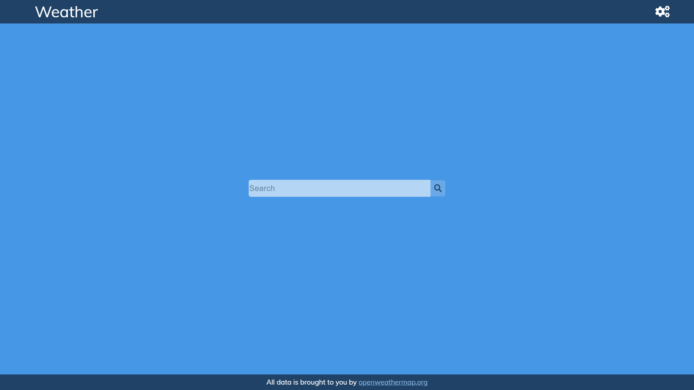
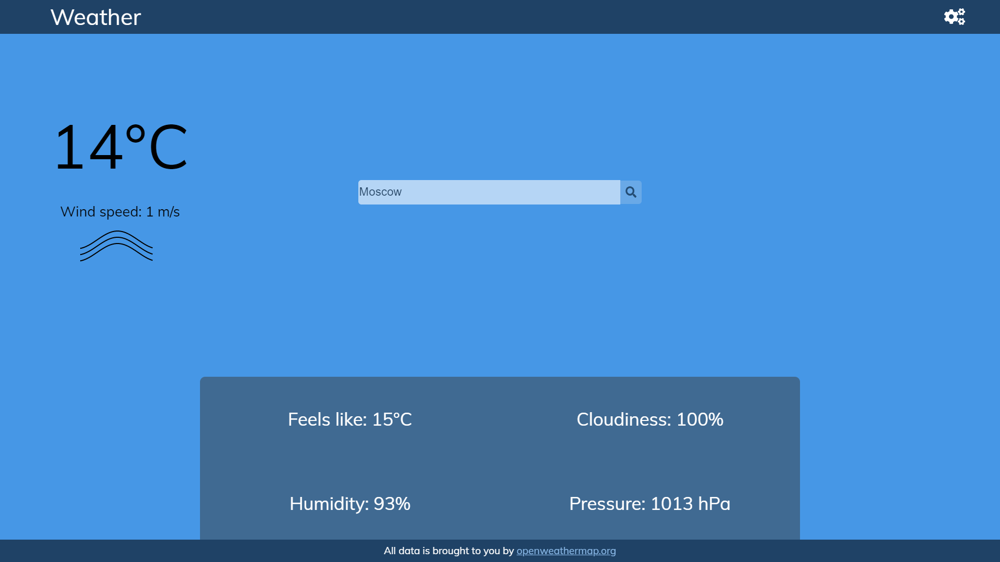
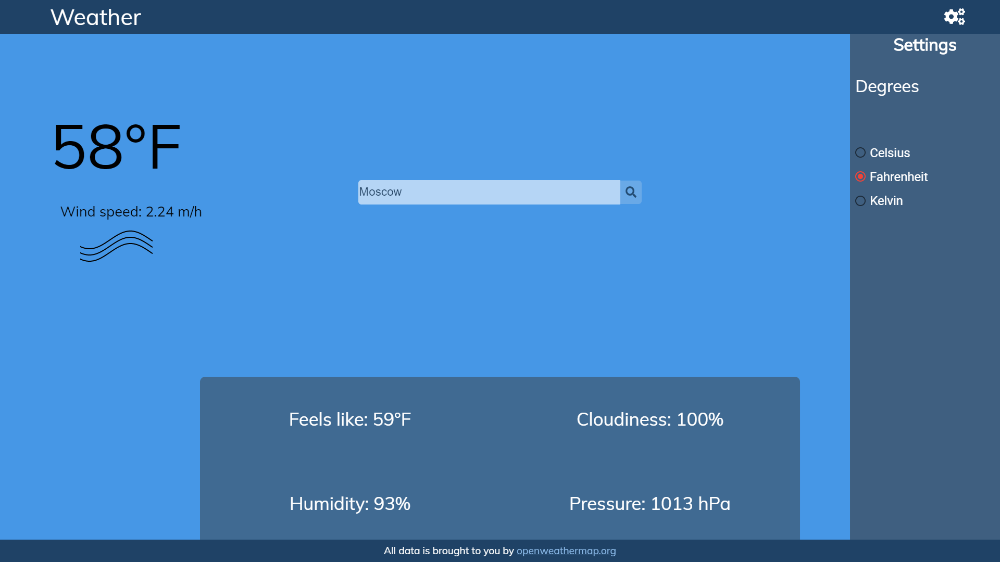

# WeatherApp

This project was generated with [Angular CLI](https://github.com/angular/angular-cli) version 9.1.0 and was updated to version 10.0.0

Этот проект был создан при помощи [Angular CLI](https://github.com/angular/angular-cli) версии 9.1.0 и был обновлён до версии 10.0.0

## Development server

Run `ng serve` or `npm start` for a dev server. To install all the dependencies write `npm install` in the console. Navigate to `http://localhost:4200/`. The app will automatically reload if you change any of the source files.

## Сервер разработки

Пропишите `ng serve` или `npm start` для создания сервера разработки. Для установки всех зависимостей пропишите `npm install` в консоли. Перейдите к `http://localhost:4200/`. Приложение автоматически перезагрузится если вы совершили какие-либо изменения с исходными файлами.

## Build

Run `ng build` to build the project. Use the `--prod` flag for a production build.

## Сборка

Пропишите `ng build` чтобы собрать проект. Используйте флаг `--prod` для производственной сборки.

## Running unit tests

Run `ng test` to execute the unit tests via [Karma](https://karma-runner.github.io).

## Использование unit тестов

Пропишите `ng test` для проведения unit тестов при помощи [Karma](https://karma-runner.github.io).

## Running end-to-end tests

Run `ng e2e` to execute the end-to-end tests via [Protractor](http://www.protractortest.org/).

## Использование e2e тестов

Пропишите `ng e2e` для проведения e2e тестов при помощи [Protractor](http://www.protractortest.org/).

## Images

